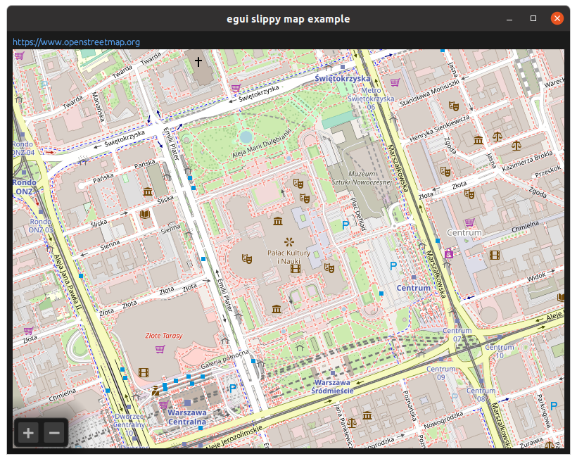

Example of how to render a slippy map in [egui](https://github.com/emilk/egui)
using [OpenStreetMap](https://www.openstreetmap.org/).

A lot of functionality is missing, code is undocumented, suboptimal in many ways
and it's not generic enough to be released as a library crate. It serves as an
example which you're free to copy and improve.

